<div align="center">
  
  
  
  
  <br />
  <h1>🎓 UMS Replica</h1>
  <h3>Industrial-Grade University Management System</h3>
  <p><strong>A modular, scalable, and secure educational platform built on a modern PIS (Platform as an Integration System) framework.</strong></p>

  Backend -- https://ums-api-btvo.onrender.com/
  
  <div style="display: flex; justify-content: center; gap: 10px; flex-wrap: wrap;">
    <a href="https://fastapi.tiangolo.com/"></a>
    <a href="https://nextjs.org/"></a>
    <a href="https://www.postgresql.org/"></a>
    <a href="https://www.docker.com/"></a>
    <a href="https://tailwindcss.com/"></a>
    <a href="https://ui.shadcn.com/"></a>
  </div>
</div>

---

## 📖 Executive Summary

The **UMS Replica** is an enterprise-level, full-stack educational ecosystem designed to digitize and streamline administrative, academic, and student-facing processes. Engineered with strict **Domain-Driven Design (DDD)** and utilizing the **PIS (Platform as an Integration System)** framework, this project serves as a comprehensive digital twin for modern universities.

It seamlessly integrates varied academic modules—from real-time WebSocket communication to strict academic grading and residence management algorithms—into a single, unified, and highly performant architecture capable of handling high concurrent user loads.

---

## 🏛️ PIS Framework & Architectural Philosophy

This UMS is built upon the **PIS (Platform as an Integration System)** paradigm, ensuring that isolated system domains can communicate frictionlessly while maintaining strict, secure boundaries.

```mermaid
graph TD
    Client[Next.js Client] -->|HTTPS/REST| APIGateway(FastAPI Gateway)
    Client -->|WSS/WebSockets| ChatHub(Real-Time Comm Hub)
    
    APIGateway --> AuthDomain((🛡️ Auth Domain))
    APIGateway --> AcademicDomain((📚 Academic Domain))
    APIGateway --> HousingDomain((🏢 Housing Domain))
    
    AuthDomain --> Postgres[(PostgreSQL)]
    AcademicDomain --> Postgres
    HousingDomain --> Postgres
    
    ChatHub --> Redis[(Redis Cache/PubSub)]
    
    style APIGateway fill:#009688,stroke:#fff,stroke-width:2px,color:#fff
    style Postgres fill:#316192,stroke:#fff,stroke-width:2px,color:#fff
```



### Core Architectural Tenets:
1. **Modular Monolith Paradigm:** Domains (`/auth`, `/academics`, `/housing`) are logically separated within the backend core. This allows for zero-friction extraction into discrete microservices as organizational scale demands without rewriting business logic.
2. **12-Factor App Compliance:** Configuration is strictly environment-driven (`.env`). Deployment methodologies remain identical across local sandboxes, staging, and production environments.
3. **Event-Driven Resilience:** Real-time components utilize decoupled architectures (WebSockets & Pub/Sub via Redis) to ensure high availability without blocking primary HTTP request threads.
4. **End-to-End Type Safety:** From database schemas (SQLAlchemy Mapped Types) to API boundaries (Pydantic v2) and the Frontend client (TypeScript), absolute type safety eliminates entire classes of runtime errors.

---

## ✨ Features by Domain

### 🛡️ 1. Security & Identity Management (Auth Domain)
* **Granular RBAC:** Route-level, middleware-enforced authorization for Students, Faculty, and Administrators.
* **Cryptographic Resilience:** `Argon2id` password hashing prevents rainbow-table and brute-force attacks.
* **Stateless Authentication:** Highly secure JWT-based access tokens with rotating refresh tokens.

### 📚 2. Academic Core (Academics Domain)
* **Dynamic Curriculum Management:** Course creation, credit allocation, and department tagging.
* **Attendance Engineering:** Faculty portal for real-time attendance marking; student dashboards for penalty-threshold tracking rendered natively via progressive indicators.
* **Algorithmic Analytics:** Centralized gradebook management with chronological CGPA/GPA trend visualization logic.
* **Conflict-Free Timetabling:** Algorithmic schedule allocation mapping courses to physical rooms and temporal boundaries.

### 🏢 3. Campus Logistics (Housing Domain)
* **Residence Management Model (RMS):** Real-time tracking of hostel buildings, floor plans, room capacity constraints (Single/Double/Suite), and occupancy matrices.
* **Maintenance Ticketing Pipeline:** State-machine driven ticketing system for facility issues, featuring strict status progression (Pending ➔ In Progress ➔ Resolved).

### 💬 4. Real-Time Communication Hub
* **WebSocket Chat System:** Instant, zero-latency messaging for departmental groups and direct channels.
* **Digital Leave Workflow:** Automated leave request management system with secure approval routing chains for students and faculty.

### 🖥️ 5. Next-Gen Frontend UI/UX (Web App)
* **Glassmorphism Aesthetic:** A highly polished, depth-aware dark mode interface leveraging `Shadcn/UI` and `Tailwind CSS`.
* **Micro-Animations:** Fluid state transitions using CSS and Framer Motion to provide premium, tactile user feedback.
* **Optimized Data Pipeline:** `Zustand` for global state persistence and `TanStack Query` for asynchronous fetching, caching, and optimistic UI updates.

---

## � Project Structure

```text
UMS/
├── apps/
│   ├── api/                     # Python / FastAPI Backend
│   │   ├── alembic/             # Database migration scripts
│   │   ├── app/                 
│   │   │   ├── core/            # Config, Database Engine, Security Dependencies
│   │   │   ├── auth/            # Authentication routers & schemas
│   │   │   ├── users/           # User lifecycle & profiles
│   │   │   ├── academics/       # Courses, grades, attendance
│   │   │   ├── housing/         # RMS & Maintenance ticketing
│   │   │   └── communication/   # WebSocket Chat & Leaves
│   │   ├── main.py              # Application factory & ASGI entry
│   │   └── requirements.txt     
│   │
│   └── web/                     # TypeScript / Next.js 14 Frontend
│       ├── src/
│       │   ├── app/             # Next.js App Router (Pages & Layouts)
│       │   ├── components/      # Reusable Radix/Shadcn UI components
│       │   ├── lib/             # API client, utility functions
│       │   └── store/           # Zustand state management
│       ├── tailwind.config.ts   
│       └── package.json         
│
├── docker-compose.yml           # Multi-container orchestration
└── README.md                    # You are here
```

---

## 🛠️ API Endpoint Geography

The API follows strict RESTful conventions under the `/api/v1` prefix.

| Domain | Base Endpoint | Core Methods | Purpose |
| :--- | :--- | :--- | :--- |
| **Auth** | `/auth/login` | `POST` | Exchanges credentials for JWT tokens. |
| **Users** | `/users/me` | `GET`, `PATCH` | Retrieves/updates authenticated user profile. |
| **Academics** | `/academics/courses` | `GET`, `POST` | Curriculum management (RBAC protected). |
| **Housing** | `/housing/rooms` | `GET` | Retrieves hostel inventory and occupancy. |
| **Comm** | `/communication/ws`| `WS` | Upgrades connection for real-time chat. |

_Access the interactive Swagger documentation at `http://localhost:8000/docs` for exact payload schemas._

---

## 🚀 Environment Setup & Deployment

### Local Development Paradigm (Sandbox Mode)
Designed for immediate developer onboarding, the sandbox mode defaults to an ephemeral SQLite database (`ums_dev.db`), bypassing complex PostgreSQL setup.

**1. Spin up the API Server**
```bash
cd apps/api
pip install -r requirements.txt

# Seed the database with Admin, Faculty, and Student demo accounts
python -m app.seed 

# Initialize Uvicorn ASGI Server
uvicorn main:app --reload --port 8000
```

**2. Spin up the Web Client**
```bash
cd ../web
npm install
npm run dev
```

### Production Grade Deployment (Dockerized)
For staging or production, Docker orchestrates the entire PIS framework, utilizing asynchronous PostgreSQL and Redis.

```bash
# Execute from the repository root
docker-compose up --build -d
```
_This initiates the API (Port 8000), Web (Port 3000), PostgreSQL (Port 5432), and Redis (Port 6379) in isolated, networked containers._

---

## 🔐 Demo Sandbox Credentials

Use the following secure credentials (provisioned via `app.seed`) to test the RBAC layers natively:

| Role Identity | Email | Password |
| :--- | :--- | :--- |
| **System Administrator** | `admin@ums.edu` | `Admin@123` |
| **Faculty Member** | `prof.sharma@ums.edu` | `Faculty@123` |
| **Enrolled Student** | `manohar.k@ums.edu` | `Student@123` |

---

## ☁️ Zero-Friction Cloud Deployment (Render / Railway)

The monolithic nature of this PIS framework allows for incredibly fast Platform-as-a-Service (PaaS) deployments.

1. **Database:** Provision an async **PostgreSQL** instance on your PaaS of choice and copy the connection URI.
2. **API Deployment:** Deploy the `apps/api` directory as a Web Service.
   - Build Command: `pip install -r requirements.txt`
   - Start Command: `uvicorn main:app --host 0.0.0.0 --port $PORT`
   - Environment Variable: Set `DATABASE_URL` to your PostgreSQL URI.
3. **Web Deployment:** Deploy the `apps/web` directory as a Static/Node Web Service.
   - Environment Variable: Set `NEXT_PUBLIC_API_URL` to your newly minted backend domain.

---
<div align="center">
  <br/>
  <b>Engineered for architectural scale. Designed for unparalleled usability.</b>
  <br/>
  <i>Built utilizing FastAPI, Next.js, and the PIS Framework.</i>
</div>
